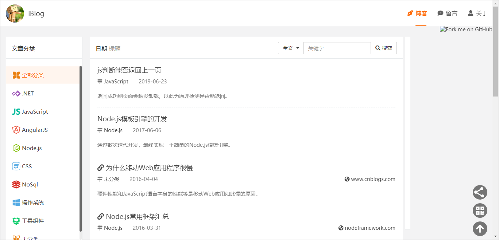

# **概述**

## **文档目的**

本文通过示例项目“iBlog个人独立博客系统”介绍如何使用DevCloud开发基于Node.js语言的Web应用，为研发Node.js项目的企业或个人提供上云指导。

## **项目详情**

-   项目名称：iBlog个人博客系统。
-   项目简介：iBlog是基于Node.js的开源个人博客系统。现代化的 UI 和用户体验。采用响应式布局，支持手机访问，支持离线访问。不仅仅是博客，更是 Demo，是适合新人入门学习的完整项目。

    

-   开发语言：node.js。
-   项目类型：使用 Node.js 和 MongoDB 开发的博客系统。
-   部署环境：Linux。
-   功能模块：功能模块、文章列表、文章详情、留言、关于、后台管理。
-   技术构成：

    
    <table><tbody><tr id="row105811710154613"><td class="cellrowborder" valign="top" width="25%">
服务端 Node.js

    </td>
    <td class="cellrowborder" valign="top" width="25%">
web框架 Express 4

    </td>
    <td class="cellrowborder" valign="top" width="25%">
模板引擎Pug

    </td>
    <td class="cellrowborder" valign="top" width="25%">
JS库 jQuery

    </td>
    </tr>
    <tr id="row15814101469"><td class="cellrowborder" valign="top" width="25%">
Web字体 Font Awesome

    </td>
    <td class="cellrowborder" valign="top" width="25%">
持久化 MongoDB

    </td>
    <td class="cellrowborder" valign="top" width="25%">
日志 ServerLog

    </td>
    <td class="cellrowborder" valign="top" width="25%">
多语言 i18n

    </td>
    </tr>
    <tr id="row35821310194615"><td class="cellrowborder" valign="top" width="25%">
Service Worker库 Workbox

    </td>
    <td class="cellrowborder" valign="top" width="25%">
UI库 Bootstrap 3

    </td>
    <td class="cellrowborder" valign="top" width="25%">
身份验证 Passport

    </td>
    <td class="cellrowborder" valign="top" width="25%">
-

    </td>
    </tr>
    </tbody>
    </table>

## **前提条件**

使用DevCloud开展本例前，需要先进行以下步骤。若已有华为云账号及弹性云服务器，则可忽略。

-   注册华为云账号：在[华为云官网](https://www.huaweicloud.com/)注册华为云账号，并进行实名认证，此账号适用于所有华为云产品。
-   购买弹性云服务器：部署将使用带有公网IP的华为云ECS（本文中使用的操作系统为CentOS 7.4）。ECS的购买方式请参考[购买并登录Linux弹性云服务器](https://support.huaweicloud.com/qs-ecs/zh-cn_topic_0132727313.html)。

    > **说明：**   
    >-   本例中对弹性云服务器的推荐配置为：2vCPUs|4GB|CentOS 7.4 64bit。  
    >-   弹性云服务器的购买方式有“包周期“与“按需“，若只参考本例进行DevCloud体验，可选择“按需购买”方式，在体验之后将弹性云服务器删除，避免产生不必要的费用。  

## **项目过程**

DevCloud基本操作流程请参考[快速上手DevCloud](https://support.huaweicloud.com/qs-devcloud/devcloud_qs_1000.html)。

1.  [创建项目、进行项目规划](基于Node-js的Web应用开发-创建项目-进行项目规划.md)
2.  [创建代码仓库、管理项目代码](基于Node-js的Web应用开发-创建代码仓库-管理项目代码.md)
3.  [部署代码至云主机](基于Node-js的Web应用开发-部署代码至云主机.md)
4.  [创建流水线、实现持续交付](基于Node-js的Web应用开发-创建流水线-实现持续交付.md)

  

