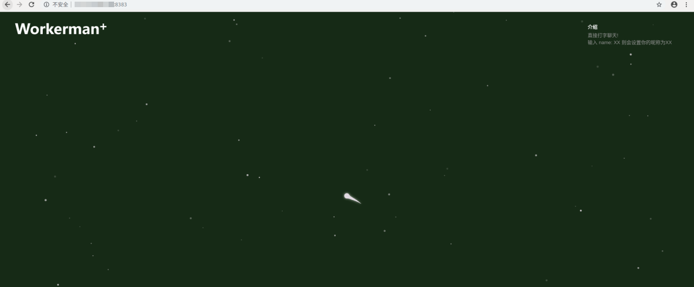

# **概述**

## **文档目的**

本文通过示例项目“小蝌蚪即时交互游戏”介绍如何使用DevCloud开发基于PHP语言的H5应用，为研发PHP项目的企业或个人提供上云指导。

## **项目详情**

-   项目名称：小蝌蚪即时交互游戏。
-   项目简介：“小蝌蚪即时交互游戏“采用PHP\(workerman框架\)+HTML5技术开发，是一款以workerman作为应用服务器，前端采用HTML5+WebSocket开发。游戏交互很简单，点击屏幕小蝌蚪可以自由游动，其它玩家可以看到周围玩家的游动状态，并且可以即时聊天。

    

      

-   项目架构 :
    -   前端采用HTML5开发。
    -   以PHP的workerman框架开发后台游戏服务器。
    -   后端PHP多进程支持。
    -   采用WebSocket协议。
    -   PHP实时推送技术。
    -   独立运行，不依赖Mysql、apache、nginx等软件。

-   部署环境：Ubuntu 16.04。
-   涉及华为云服务：
    -   [软件开发平台 DevCloud](https://www.huaweicloud.com/devcloud/)
    -   [弹性云服务器 ECS](https://www.huaweicloud.com/product/ecs.html)

## **前提条件**

使用DevCloud开展本例前，需要先进行以下步骤。若已有华为云账号及弹性云服务器，则可忽略。

-   注册华为云账号：在[华为云官网](https://www.huaweicloud.com/)注册华为云账号，并进行实名认证，此账号适用于所有华为云产品。
-   购买弹性云服务器：部署将使用带有公网IP的华为云ECS（本文中使用的操作系统为CentOS 7.1）。ECS的购买方式请参考[购买并登录Linux弹性云服务器](https://support.huaweicloud.com/qs-ecs/zh-cn_topic_0132727313.html)。

    > **说明：**   
    >-   本例中对弹性云服务器的配置没有特殊要求，购买时选择最基本配置即可。  
    >-   弹性云服务器的购买方式有“包周期“与“按需“，若只参考本例进行DevCloud体验，可选择“按需购买”方式，在体验之后将弹性云服务器删除，避免产生不必要的费用。  

## **项目过程**

DevCloud基本操作流程请参考[快速上手DevCloud](https://support.huaweicloud.com/qs-devcloud/devcloud_qs_1000.html)。

本例中将依次进行以下步骤：

1.  [创建项目、进行项目规划](基于PHP的H5应用开发-创建项目-进行项目规划.md)
2.  [创建代码仓库、管理项目代码](基于PHP的H5应用开发-创建代码仓库-管理项目代码.md)
3.  [构建并归档软件包](基于PHP的H5应用开发-构建并归档软件包.md)
4.  [部署软件包至云主机](基于PHP的H5应用开发-部署软件包至云主机.md)

  

